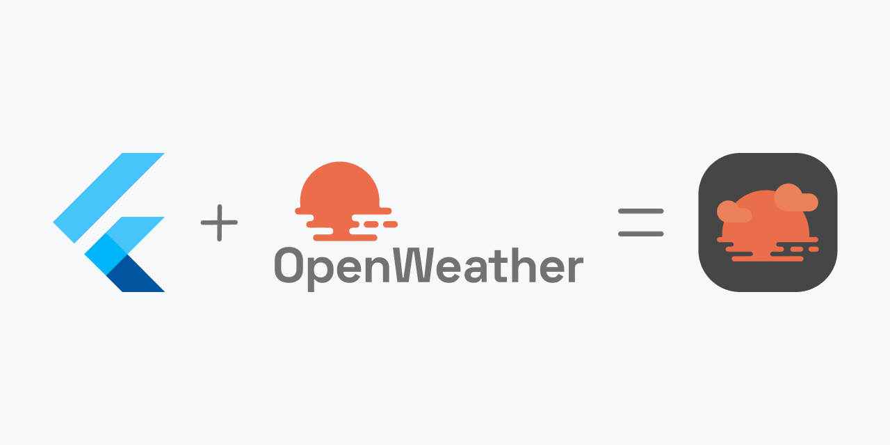
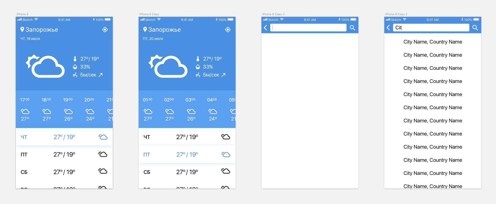
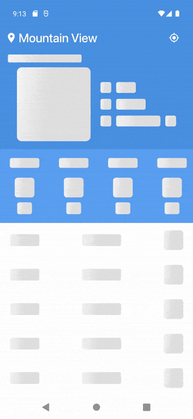

       

# Natife Weather - weather app

This is a demo application to view weather forecast for today, the next 48 hours and a week ahead. The application is developed using Flutter framework and uses data from [OpenWeatherMap API](https://openweathermap.org/api).

## Demo

|iOS|android|
|:------------:|:------------:|
|  |  |

## Features

- View current weather with maximum and minimum temperature, average humidity, wind speed and direction.
- Detailed forecast for the next 48 hours with hourly temperature information.
- Week ahead weather forecast including maximum and minimum temperatures for each day.
- Possibility to search for settlements with autocompletion by keyboard input.
- Selecting a settlement and then downloading the weather to the main screen.

## Packages involved in the project
          

|Packages|Description|
|--------|-----------|
|[flutter_svg](https://pub.dev/packages/flutter_svg)|For working with vector images. Draw SVG files using Flutter.|
|[http](https://pub.dev/packages/http)|A composable, Future-based library for making HTTP requests. This package contains a set of high-level functions and classes that make it easy to consume HTTP resources. It's multi-platform, and supports mobile, desktop, and the browser.|
|[shimmer](https://pub.dev/packages/shimmer)|A package provides an easy way to add shimmer effect in Flutter project.|
|[intl](https://pub.dev/packages/intl)|Provides internationalization and localization facilities, including message translation, plurals and genders, date/number formatting and parsing, and bidirectional text.|
|[geolocator](https://pub.dev/packages/geolocator)|A Flutter geolocation plugin which provides easy access to platform specific location services ([FusedLocationProviderClient](https://developers.google.com/android/reference/com/google/android/gms/location/FusedLocationProviderClient) or if not available the [LocationManager](https://developer.android.com/reference/android/location/LocationManager) on Android and [CLLocationManager](https://developer.apple.com/documentation/corelocation/cllocationmanager) on iOS).|
|[geocoding](https://pub.dev/packages/geocoding)|A Flutter Geocoding plugin which provides easy geocoding and reverse-geocoding features.|
|[fluttertoast](https://pub.dev/packages/fluttertoast)|Toast library for Flutter - simple toast messages.|
|[flutter_app_renamer](https://pub.dev/packages/flutter_app_renamer)|A command-line tool that makes it easy to change your project's AppName and BundleID by defining them in your pubspec.yaml file.|
|[flutter_launcher_icons](https://pub.dev/packages/flutter_launcher_icons)|A command-line tool which simplifies the task of updating your Flutter app's launcher icon. Fully flexible, allowing you to choose what platform you wish to update the launcher icon for and if you want, the option to keep your old launcher icon in case you want to revert back sometime in the future.|
|[flutter_gen](https://pub.dev/packages/flutter_gen)|The Flutter code generator for your assets, fonts, colors, … — Get rid of all String-based APIs.|
|[build_runner](https://pub.dev/packages/build_runner)|As a part of FlutterGen. The `build_runner` package provides a concrete way of generating files using Dart code. Files are always generated directly on disk, and rebuilds are _incremental_.|

## API used in the project
 

|Endpoints|Description|
|---------|-----------|
|[Current and forecast weather data](https://openweathermap.org/api/one-call-api)|Make just one API call and get all your essential weather data for a specific location with an OpenWeather **One Call API 2.5**. The One Call API 2.5 provides the following weather data for any geographical coordinates:   - Current weather   - Hourly forecast for 48 hours   - Daily forecast for 7 days|      
|[Coordinates by location name](https://openweathermap.org/api/geocoding-api)|Direct geocoding allows to get geographical coordinates (lat, lon) by using name of the location (city name or area name). If you use the `limit` parameter in the API call, you can cap how many locations with the same name will be seen in the API response (for instance, London in the UK and London in the US).|